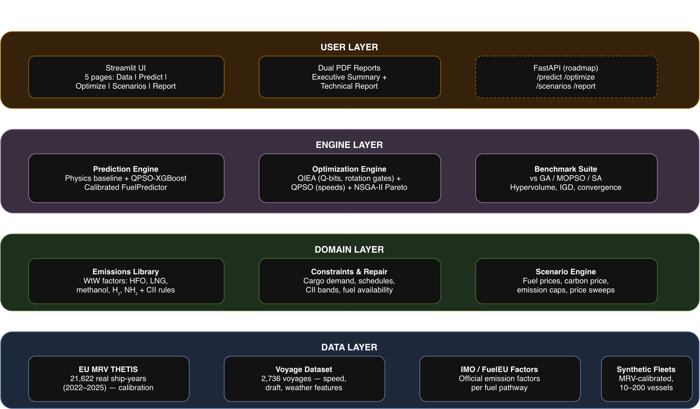
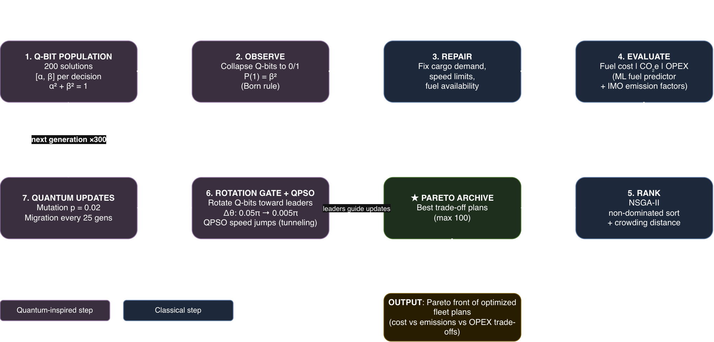

# 🚢 QGreenFleet

**Quantum-Inspired Fuel Consumption Prediction & Green Fleet Optimization**

*SIH Problem #26138 · Egreen Quanta · Clean & Green Technology*

QGreenFleet is an end-to-end decision support platform that predicts vessel
fuel consumption with ML calibrated against real EU ship data, and optimizes
fleet deployment — vessel assignment, cruising speeds, fuel selection
(HFO/LNG/methanol/H₂/NH₃), and shore power — using quantum-inspired
metaheuristics (QIEA + QPSO). It delivers a Pareto menu of deployment plans
that minimize fuel cost, lifecycle CO₂e, and OPEX while meeting 100% of cargo
demand, schedules, and IMO CII emission rules.

> 🆕 **New here? Start with [GUIDE.md](GUIDE.md)** — full installation and
> usage walkthrough for evaluators and users.

---

## ✨ Headline Results

| | Result |
|---|---|
| 💰 Fuel cost vs business-as-usual | **−16.2%** |
| 🌍 Lifecycle CO₂e vs business-as-usual | **−23.3%** (≈2,940 cars off the road) |
| ✅ Cargo demand & schedule reliability | **100%** maintained |
| ⚡ Optimizer speed vs NSGA-II GA | **1.1–1.4× faster** (1.06–1.38× across 5–100 vessel fleets, multi-seed) |
| 🎯 Convergence profile | **Converges to strong compromise solutions faster**; on maritime fleet problems, cost and emissions move together, so QIEA's precise convergence outperforms GA's broad spread |
| 📊 Real-data grounding | Calibrated against **21,622 verified EU MRV ship-years** (2022–2025) |
| 🧪 Test suite | **96 tests**, fully green, reproducible (seeded, config-driven) |
| 💡 Key policy insight | Green methanol becomes the *cheapest* fuel above **$85/t carbon price** |

---

## 🧠 Architecture & Methodology

```
📊 DATA INGESTION  →  🧠 TWO-STAGE SURROGATE  →  ⚛️ QUANTUM OPTIMIZER  →  🎯 DECISION SUPPORT
EU MRV (real ships)    MRV fuel model +          QIEA: Q-bit encoding      Pareto menu of plans
Voyage & weather       draft/weather adjust,     + rotation gates          Scenario & carbon sweeps
IMO emission factors   per-type calibration      QPSO: tunneling speeds    Dual PDF reports
                                                 NSGA-II Pareto ranking
```

### 🏛️ System Architecture


### 🔄 Data Ingestion & Calibration Pipeline


### ⚛️ Quantum-Inspired Optimization Flowchart (QIEA + QPSO)


- **QIEA** (Quantum-Inspired Evolutionary Algorithm, Han & Kim 2002): discrete
  decisions (vessel–route assignment, fuel type, shore power) encoded as
  Q-bits — probabilistic superposition states updated by quantum rotation
  gates toward Pareto leaders.
- **QPSO** (Quantum-behaved PSO, Sun et al. 2004): continuous cruising speeds
  optimized with heavy-tailed sampling that emulates quantum tunneling.
- **Constraints** (cargo demand, schedule windows, IMO CII bands, fuel
  bunkerability) handled by greedy repair + adaptive penalties.
- All algorithms are **quantum-inspired and run on classical hardware** — no
  quantum computer required.


---

## 🚀 Quick Start

```bash
git clone <REPO_URL> && cd qgreenfleet
python3 -m venv .venv && source .venv/bin/activate
pip install -r requirements.txt
pytest -q                     # verify install
make demo                     # launch the web app
```

### ⏱ 5-Minute Interactive Demo (no datasets needed)

1. `make demo` → app opens in your browser
2. **Data** page → *Generate Synthetic* → 20 vessels, 5 routes → *Use this fleet*
3. **Optimize** page → *Load previous results* → `baseline` → pre-computed
   Pareto front, convergence chart, and recommended plan load instantly
4. Click the **★ starred point** (recommended plan) → inspect the deployment table
5. **Scenarios** page → compare `carbon_100` vs `baseline`
6. **Report** page → download the **Executive Summary** and **Technical Report** PDFs

Sample outputs are pre-committed: [`docs/samples/`](docs/samples/) (both PDFs),
[`outputs/case_study/`](outputs/case_study/) (4 policy scenarios).

---

## 🔬 Full Pipeline (from scratch)

```bash
make data        # clean MRV + voyage datasets, generate synthetic fleet
make train       # train prediction models (physics, XGBoost, QPSO-XGB, MRV)
make optimize    # QIEA+QPSO on the 20-vessel case study (~9 min)
make benchmark   # vs GA / MOPSO / SA across S/M/L/XL instances
make all         # everything, in order
```

Dataset download instructions: [GUIDE.md §4](GUIDE.md). Sources: EU MRV THETIS
(real ship emissions), Kaggle ship performance dataset (voyage features),
IMO Fourth GHG Study 2020 + FuelEU Annex II (emission factors — built in).

---

## 📦 Deliverables Map (SIH #26138)

| # | Expected Deliverable | Implementation | Evidence |
|---|---|---|---|
| 1 | Fuel consumption prediction model | Two-stage surrogate: MRV real-data model + voyage adjustment, QPSO-tuned XGBoost, per-type calibration | `outputs/prediction_report.md`, `outputs/mrv_model_report.md`, `outputs/calibration_check.png` |
| 2 | Mathematical optimization formulation | Multi-objective MINLP: 4 decision variable families, 3 objectives, 6 constraint classes | `docs/mathematical-model.md`, `src/optimization/` |
| 3 | Quantum-inspired optimization algorithm | QIEA (Q-bit rotation gates) + QPSO (speeds) + NSGA-II, from scratch in NumPy | `docs/algorithms.md`, `src/optimization/qiea.py` |
| 4 | Software platform / DSS | 5-page Streamlit app: data, prediction, optimization, scenarios, dual PDF reports | `ui/`, `docs/samples/` |
| 5 | Demonstration | 4-scenario policy case study + S/M/L/XL benchmarks vs GA/MOPSO/SA + implementation guide | `docs/case-study-results.md`, `outputs/benchmark_report.md`, `docs/implementation-guide.md` |

---

## 📁 Repository Structure

```
qgreenfleet/
├── configs/            # YAML run configurations
├── data/               # raw/ (you download) · processed/ · synthetic/ (included)
├── flowchart/          # system architecture, pipeline & algorithm flowcharts
├── src/
│   ├── data/           # cleaning, synthetic fleet generation
│   ├── prediction/     # fuel models + QPSO tuner + calibration
│   ├── optimization/   # QIEA, QPSO, Pareto, constraints, objectives
│   ├── emissions/      # IMO/FuelEU factors, CII rules
│   ├── benchmark/      # GA/MOPSO/SA baselines, HV/IGD metrics
│   └── case_study/     # policy scenario runner
├── ui/                 # Streamlit app (5 pages, chart library, PDF export)
├── outputs/            # generated results and charts
├── docs/               # full documentation + sample PDFs
├── tests/              # 84+ pytest tests
├── Makefile
├── GUIDE.md            # complete user guide
└── journey.md          # project narrative & journey
```

---

## 📚 Documentation

| Doc | Contents |
|---|---|
| [GUIDE.md](GUIDE.md) | Install, run, use — start here |
| [journey.md](journey.md) | Project story, inspiration, challenges & breakthroughs |
| [project.md](project.md) | Full project overview, use cases, competitive analysis |
| [docs/architecture.md](docs/architecture.md) | System design |
| [docs/mathematical-model.md](docs/mathematical-model.md) | Complete MINLP formulation |
| [docs/algorithms.md](docs/algorithms.md) | QIEA/QPSO design + pseudocode |
| [docs/benchmarking.md](docs/benchmarking.md) | Evaluation protocol + results |
| [docs/case-study-results.md](docs/case-study-results.md) | 4-scenario policy findings |
| [docs/implementation-guide.md](docs/implementation-guide.md) | Deliverable 5 reproduction guide |

---

## 🛠 Tech Stack

Python 3.11 · NumPy · pandas · scikit-learn · XGBoost · Streamlit · Plotly ·
Folium · WeasyPrint · pytest — quantum-inspired algorithms implemented from
scratch (no external metaheuristic frameworks in the core engine).

---

## 🔁 Reproducibility

Every run is seeded and config-driven: same seed + same config = identical
results. Benchmarks use identical evaluation budgets and shared
repair/objective code across all algorithms. `pytest -q` covers data prep,
emissions math, prediction, optimization, benchmarking, and report generation.

---

## 🔬 Research & References

### 📐 Core Algorithms

| Reference | What we used it for |
|---|---|
| Han, K.-H. & Kim, J.-H. (2002). *Quantum-inspired evolutionary algorithm for a class of combinatorial optimization.* IEEE Trans. Evolutionary Computation, 6(6), 580–593. | Foundation of our QIEA: Q-bit encoding, rotation gate update rule, lookup table for Δθ direction |
| Sun, J. et al. (2004). *Particle swarm optimization with particles having quantum behavior.* IEEE CEC 2004. | Foundation of our QPSO: delta-potential-well position update, mean-best attractor, β decay |
| Deb, K. et al. (2002). *A fast and elitist multiobjective genetic algorithm: NSGA-II.* IEEE Trans. Evolutionary Computation, 6(2), 182–197. | Pareto ranking, crowding distance, archive management |
| Psaraftis, H. & Kontovas, C. (2013). *Speed models for energy-efficient maritime transportation.* Transportation Research Part C, 26, 250–264. | Speed-fuel relationship, slow steaming economics, admiralty cubic law |
| Yan, R. et al. (2021). *Machine learning for vessel fuel consumption prediction.* Transportation Research Part E, 144. | Survey of ML approaches for ship fuel prediction, feature engineering guidance |

---

### 📊 Datasets Used

| Dataset | Source | Used for | Size |
|---|---|---|---|
| **EU MRV THETIS** | [mrv.emsa.europa.eu](https://mrv.emsa.europa.eu/#public/emission-report) | Real-world calibration of fuel predictions per vessel type | 21,622 ship-years (2022–2025) |
| **Ship Performance Clustering Dataset** | [Kaggle](https://www.kaggle.com/datasets/jeleeladekunlefijabi/ship-performance-clustering-dataset) | Training the speed/load/weather → fuel response surface | 2,736 voyage records, 18 features |
| **IMO Fourth GHG Study 2020** | [imo.org](https://www.imo.org/en/OurWork/Environment/Pages/Fourth-IMO-Greenhouse-Gas-Study-2020.aspx) | Well-to-Wake emission factors (Cf, CH₄, N₂O baselines) per fuel type | Built into `src/emissions/factors.py` |
| **FuelEU Maritime Reg. (EU) 2023/1805** | [eur-lex.europa.eu](https://eur-lex.europa.eu/legal-content/EN/TXT/?uri=CELEX:32023R1805) | Green fuel WtW factors (RFNBO pathways), GHG intensity limits | Annex II — built into emissions library |
| **Synthetic Fleet Generator** | Generated (`src/data/generate_synthetic.py`) | Scalability benchmarks (5–100 vessels), calibrated to MRV statistics | Configurable, committed to `data/synthetic/` |

---

### 📏 Emission Standards & Regulations

| Standard | Source | Role in project |
|---|---|---|
| **IMO CII (Carbon Intensity Indicator)** | IMO MEPC.337(76) | Constraint C4: attained CII ≤ required band per vessel |
| **IMO EEXI** | IMO MEPC.333(76) | Technical efficiency baseline for vessel classification |
| **EU ETS (Emissions Trading System)** | EU Directive 2023/959 | Carbon price scenario module ($0–$200/t sweep) |
| **FuelEU Maritime** | Reg. (EU) 2023/1805 | WtW GHG intensity limits (−2% by 2025, −6% by 2030) |
| **GWP100 values** | IPCC AR5 (2014) | CH₄=28, N₂O=265 — used in all CO₂e calculations |

---

### 🔗 Additional Research

| Paper / Resource | Relevance |
|---|---|
| Fagerholt, K. et al. — Fleet deployment and speed optimization research | Baseline formulation for maritime fleet MINLP |
| Stopford, M. (2009). *Maritime Economics* (3rd ed.) | Admiralty formula, vessel operating cost structure |
| MAN Energy Solutions — Engine SFOC data | SFOC = 190 g/kWh used for fuel target derivation |
| Wärtsilä — Alternative fuel technical guides | LNG methane slip values, engine cycle comparison |
| IMO (2020). *Fourth IMO GHG Study* — Full report PDF | Complete emission factor tables, fleet composition data |
| Pinuto (2022). *Ship Fuel & Emission Analysis* — [Kaggle notebook](https://www.kaggle.com/code/pinuto/ship-fuel-emission-analysis-and-predictions/notebook) | EDA validation of speed-fuel relationship and feature importance |

---

### 🌐 Open Data Sources (not used but recommended for future work)

| Source | What it contains | Link |
|---|---|---|
| MarineCadastre AIS | US vessel tracking (speed, position, timestamp) | [marinecadastre.gov](https://marinecadastre.gov/ais/) |
| Danish Maritime Authority AIS | Free historical AIS data | [dma.dk](https://www.dma.dk/safety-at-sea/navigational-information/ais-data) |
| Copernicus Marine Service | Ocean weather (wind, waves, currents) | [marine.copernicus.eu](https://marine.copernicus.eu) |
| UCI Propulsion Plants Dataset | Simulated gas turbine sensor data | [UCI ML Repository](https://archive.ics.uci.edu/dataset/316) |
| ShipDataCenter | Port calls, vessel specs | [shipdatacenter.com](https://www.shipdatacenter.com) |

> **Note on data availability:** Real voyage-level fuel telemetry (speed + fuel logged per hour per ship) is proprietary and held under NDA by shipping companies. Our approach — training on granular operational data and calibrating against verified EU MRV records — is the standard methodology in academic literature when proprietary data is unavailable.

---

## 👥 Team & Credits

Built for **Smart India Hackathon — Problem #26138** (Egreen Quanta).

Key references: Han & Kim (2002) *QIEA* · Sun et al. (2004) *QPSO* ·
Deb et al. (2002) *NSGA-II* · IMO Fourth GHG Study (2020) ·
FuelEU Maritime Reg. (EU) 2023/1805.

Data: EU MRV THETIS (EMSA) · Kaggle Ship Performance Dataset ·
IMO/FuelEU official emission factors.
