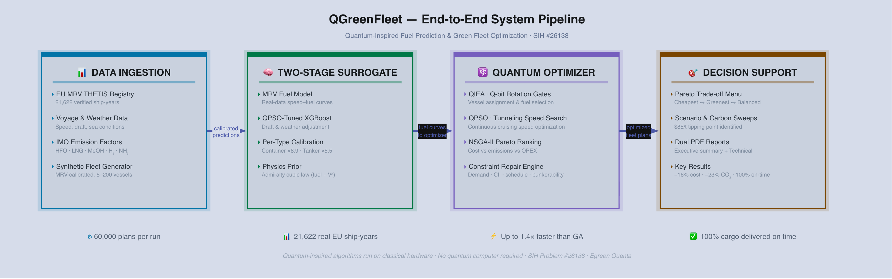
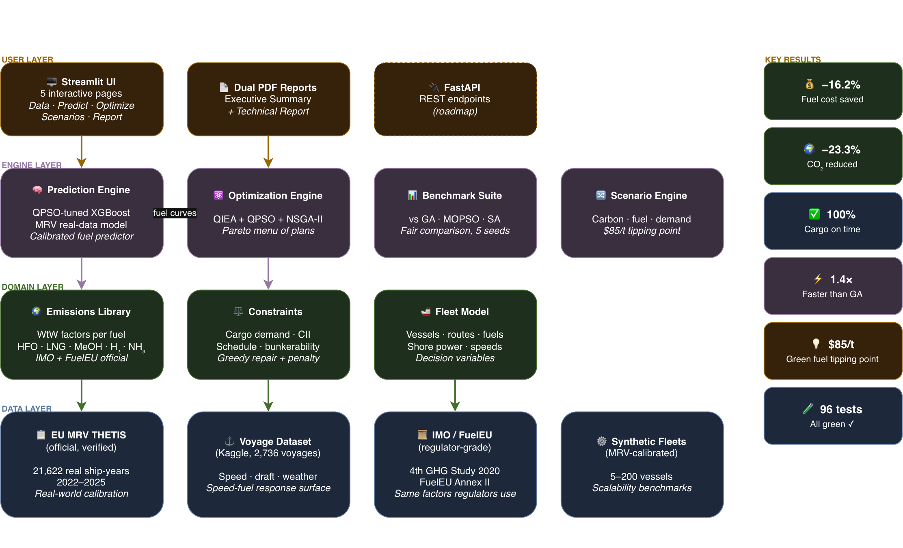
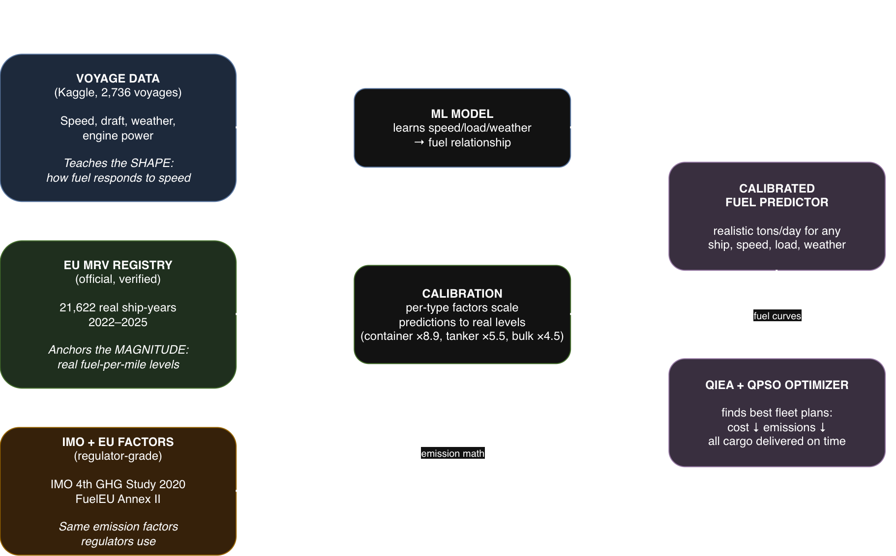
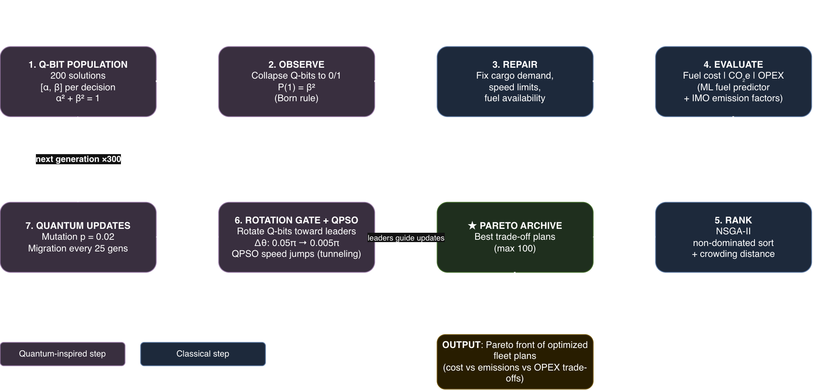

# 🚢 QGreenFleet

**Quantum-Inspired Fuel Consumption Prediction & Green Fleet Optimization**

*SIH Problem #26138 · Egreen Quanta · Clean & Green Technology*

QGreenFleet is an end-to-end decision support platform that predicts vessel
fuel consumption with ML calibrated against real EU ship data, and optimizes
fleet deployment — vessel assignment, cruising speeds, fuel selection
(HFO/LNG/methanol/H₂/NH₃), and shore power — using quantum-inspired
metaheuristics (QIEA + QPSO). It delivers a Pareto menu of deployment plans
that trade off fuel cost, lifecycle CO₂e and OPEX under cargo-demand, schedule,
vessel-availability, fuel-availability and IMO CII constraints.

Every number in this README is taken from files the pipeline generates
(`outputs/`, `docs/case-study-results.md`, `models/*_meta.json`); regenerate them
with the commands in [RUN.md](RUN.md).

> 🆕 **New here? Start with [GUIDE.md](GUIDE.md)** — full installation and
> usage walkthrough for evaluators and users.

---

## ✨ Headline Results

Case study: 20-vessel, 5-route reference fleet, QIEA+QPSO at population 100 × 100
generations, seed 42 ([full table](docs/case-study-results.md)).

| | Result (recommended plan vs business-as-usual) |
|---|---|
| 💰 Fuel cost, baseline scenario | **−60.3%** ($3.08M → $1.22M) |
| 🌍 Well-to-wake CO₂e, baseline scenario | **−80.0%** (16,852 t → 3,370 t) |
| 🧾 OPEX, baseline / $100/t carbon price | **−37.5%** / **−53.5%** |
| ✅ Constraints | every recommended plan in all 5 scenarios meets demand, schedules, vessel & fuel availability and CII |
| ⚡ Runtime vs NSGA-II GA | faster on 3 of 4 instances (1.13–1.29×), **1.13× slower** on the 100-vessel instance |
| 🎯 Solution quality (hypervolume) | QIEA best on 1 of 4 instances (M); GA best on L and XL, MOPSO on S |
| 📊 Fuel model accuracy | R² **0.52**, MAPE **26.3%** on held-out EU MRV ships; R² 0.35 / MAPE 34.5% when EEDI is unknown |
| 💡 Carbon-price sweep | no sustained methanol-over-HFO crossover between $0 and $200/t for this fleet |

**How to read the savings.** Business-as-usual is a naive plan: first-fit vessel
assignment in catalogue order, design speed, all HFO. Most of the saving comes from
choosing better-suited ships and from slow steaming inside the schedule windows —
the technical PDF breaks the CO₂e change down by lever. Slow-steaming savings use
the admiralty law with a part-load fuel penalty, not measured voyage data.

### Prediction accuracy (EU MRV THETIS, 2022–2023, ship-level 80/20 split)

| Model | R² | MAPE |
|---|---|---|
| QPSO-XGBoost, ship's own EEDI | 0.524 | 26.3% |
| QPSO-XGBoost, EEDI unknown | 0.348 | 34.5% |
| XGBoost, default hyperparameters | 0.522 | 26.5% |
| Naive category median | 0.234 | 36.9% |

QPSO tuning improves on default XGBoost only marginally. The voyage-level Kaggle
dataset shows no learnable relation between its features and fuel (every model
R² ≤ 0), so draft and weather use documented rule-based factors instead.
Details: [outputs/mrv_model_report.md](outputs/mrv_model_report.md).

---

## 🧠 Architecture & Methodology

### 🗺️ End-to-End System Pipeline


### 🏛️ System Architecture


### 🔄 Data Ingestion & Calibration Pipeline


### ⚛️ Quantum-Inspired Optimization Flowchart (QIEA + QPSO)


- **QIEA** (Quantum-Inspired Evolutionary Algorithm, Han & Kim 2002): discrete
  decisions (vessel–route assignment, fuel type, shore power) encoded as
  Q-bits — probabilistic superposition states updated by quantum rotation
  gates toward Pareto leaders.
- **QPSO** (Quantum-behaved PSO, Sun et al. 2004): continuous cruising speeds
  optimized with heavy-tailed sampling that emulates quantum tunneling.
- **Constraints** (cargo demand, schedule windows, IMO CII bands, fuel
  bunkerability) handled by greedy repair + adaptive penalties.
- All algorithms are **quantum-inspired and run on classical hardware** — no
  quantum computer required.


---

## 🚀 Quick Start

```bash
git clone https://github.com/MohdAltamish/QGreenFleet.git && cd QGreenFleet
python3 -m venv .venv && .venv/bin/pip install -r requirements.txt
(cd frontend && npm install)
make test                     # verify install
make dev                      # API on :8000 + dashboard on http://localhost:5173
```

### ⏱ 5-Minute Demo, legacy Streamlit app (no datasets needed)

1. `make demo` → app opens in your browser
2. **Data** page → *Generate Synthetic* → 20 vessels, 5 routes → *Use this fleet*
3. **Optimize** page → *Load previous results* → `baseline` → pre-computed
   Pareto front, convergence chart, and recommended plan load instantly
4. Click the **★ starred point** (recommended plan) → inspect the deployment table
5. **Scenarios** page → compare `carbon_100` vs `baseline`
6. **Report** page → download the **Executive Summary** and **Technical Report** PDFs

Sample outputs are pre-committed: [`docs/samples/`](docs/samples/) (both PDFs),
[`outputs/case_study/`](outputs/case_study/) (5 policy scenarios).

---

## 🔬 Full Pipeline (from scratch)

```bash
make data        # clean MRV + voyage datasets, generate synthetic fleet
make train       # EU MRV fuel model + voyage-level candidates
make optimize    # 5-scenario case study + carbon sweep (default budget 200 × 300)
make benchmark   # vs GA / MOPSO / SA across S/M/L/XL instances, 5 seeds
make all         # everything, in order
```

Dataset download instructions: [GUIDE.md §4](GUIDE.md#4-getting-the-data). Sources: EU MRV THETIS
(real ship emissions), Kaggle ship performance dataset (voyage features),
IMO Fourth GHG Study 2020 + FuelEU Annex II (emission factors — built in).

---

## 🖥 User Interfaces

QGreenFleet ships two front ends over the same engine — pick either.

### Streamlit app (batteries included)

```bash
make demo                    # http://localhost:8501
```

### React dashboard + REST API

```bash
make dev                     # FastAPI on :8000 (docs at /docs) + React on :5173
```

Exact copy-paste commands, ports and troubleshooting: **[RUN.md](RUN.md)**.

The React dashboard ([`frontend/`](frontend/)) is a Vite + React 19 SPA that
consumes the FastAPI layer in [`src/api/`](src/api/) — nothing is duplicated, and
both interfaces read the same models, fleets and case-study artifacts. See
[`frontend/README.md`](frontend/README.md) for the full route-to-endpoint map.

| Route | View |
|---|---|
| `/` | Landing page with live surrogate output |
| `/overview` | What the system concluded, KPIs vs business-as-usual, pipeline status |
| `/fleet` | Vessel & route catalogue; load, upload or synthesise a fleet |
| `/predict` | Single-point inference, speed–fuel curves, model registry |
| `/optimize` | Live QIEA+QPSO run with generation-by-generation progress |
| `/scenarios` | The five pre-computed policy scenarios + carbon-price sweep |
| `/benchmark` | QIEA vs GA / MOPSO / SA across S, M, L and XL instances |
| `/reports` | PDF exports, the figure library, emission factor reference |

Key endpoints (full OpenAPI schema at `http://localhost:8000/docs`):

| Method & path | Purpose |
|---|---|
| `GET /api/health` · `GET /api/overview` | Deployment status and landing KPIs |
| `GET /api/fleet` · `POST /api/fleet/{load,generate,upload-file}` | Fleet catalogue and management |
| `POST /api/predict` · `POST /api/predict/curve` | Fuel surrogate inference |
| `POST /api/optimize` → `GET /api/optimize/{job_id}` | Start and poll a live optimisation run |
| `GET /api/scenarios/{name}` · `GET /api/carbon-sweep` | Pre-computed policy results |
| `GET /api/benchmark` · `GET /api/reports/{key}` | Benchmark table and PDF exports |

Live optimisation runs on a background thread and is polled by job id, so a long
search never blocks a request; `DELETE /api/optimize/{job_id}` stops one at the
next generation boundary.

---

## 📦 Delivery Table (Expected Deliverables — SIH #26138)

✅ done · 🟡 partial — stated as it is, not as planned.

| # | Problem-statement objective / expected item | What QGreenFleet delivers | Status | Evidence |
|---|---|---|---|---|
| 1 | Accurate quantum-inspired fuel prediction across vessel types and conditions | XGBoost tuned by **QPSO** (quantum-behaved PSO) on 21,622 EU MRV ship-years; admiralty-law speed response with part-load penalty; rule-based draft and sea-state factors | 🟡 accuracy is moderate (MAPE 26–35%) | [outputs/mrv_model_report.md](outputs/mrv_model_report.md) |
| 2 | Quantum metaheuristic for vessel mix, capacities, cruising speeds | **QIEA** (Q-bit rotation gates) for assignment, fuel and shore power + **QPSO** for speeds + NSGA-II ranking, from scratch in NumPy | ✅ | [src/optimization/qiea.py](src/optimization/qiea.py), [docs/algorithms.md](docs/algorithms.md) |
| 3 | Minimise fuel, operating cost and lifecycle GHG | Objectives: fuel cost, well-to-wake CO₂e (IMO 4th GHG Study / FuelEU factors, energy basis per fuel), OPEX incl. charter and carbon price | ✅ | [docs/mathematical-model.md](docs/mathematical-model.md) |
| 4 | Reliability, cargo demand, emission regulations | C1 demand · C2 schedule · C3 vessel availability · C4 IMO CII · C5 fuel availability · C6 speed bounds; repair + adaptive penalty | 🟡 EEXI and a FuelEU intensity limit are not modelled; EU ETS only as a carbon price | [src/optimization/constraints.py](src/optimization/constraints.py) |
| 5 | Alternative fuels (LNG, methanol, H₂, NH₃) and shore power | All five fuels and shore power are decision variables. H₂/NH₃ need infrastructure the reference fleet lacks, so they are tested in a hypothetical green-corridor what-if (where the optimiser still does not choose them at the assumed prices) | 🟡 | [docs/case-study-results.md](docs/case-study-results.md) |
| 6 | Benchmark vs conventional methods: accuracy, convergence, quality, scalability | Prediction: QPSO-XGBoost vs default XGBoost vs naive baseline. Optimisation: QIEA vs GA (NSGA-II), MOPSO, SA on 5–100 vessels, equal budgets, 5 seeds, hypervolume / IGD / time | 🟡 no exact MILP baseline | [outputs/benchmark_report.md](outputs/benchmark_report.md) |
| 7 | Mathematical modelling | Multi-objective MINLP: decision variables, 3 objectives, 6 constraint classes | ✅ | [docs/mathematical-model.md](docs/mathematical-model.md) |
| 8 | Scenario analysis for alternative fuels | $100/t carbon price, tightened CII, methanol subsidy, green-corridor what-if, $0–200/t carbon sweep | 🟡 no demand-surge or emission-cap lever | [outputs/case_study/](outputs/case_study/) |
| 9 | Software platform | React dashboard + FastAPI REST API (one process in production), legacy Streamlit app, PDF reports | ✅ | [frontend/](frontend/), [src/api/](src/api/), [docs/samples/](docs/samples/) |
| 10 | Case studies | 20-vessel, 5-route fleet across 5 scenarios, generated end to end by `make optimize` | ✅ | [docs/case-study-results.md](docs/case-study-results.md) |

### Known limitations

- The reference fleets are synthetic, calibrated to EU MRV statistics; capacity is TEU for container ships and deadweight tonnes for bulk carriers and tankers, and route demand shares that unit.
- Tightening CII by 11% does not change the recommended plan for this fleet (the limit does not bind).
- Fuel shares in the carbon-price sweep fluctuate between prices at this search budget.

---

## 📁 Repository Structure

```
qgreenfleet/
├── configs/            # YAML run configurations
├── data/               # raw/ (you download) · processed/ · synthetic/ (included)
├── flowchart/          # system architecture, pipeline & algorithm flowcharts
├── src/
│   ├── data/           # cleaning, synthetic fleet generation
│   ├── prediction/     # fuel models + QPSO tuner + calibration
│   ├── optimization/   # QIEA, QPSO, Pareto, constraints, objectives
│   ├── emissions/      # IMO/FuelEU factors, CII rules
│   ├── benchmark/      # GA/MOPSO/SA baselines, HV/IGD metrics
│   ├── case_study/     # policy scenario runner
│   └── api/            # FastAPI backend for the React dashboard
├── ui/                 # Streamlit app (5 pages, chart library, PDF export)
├── frontend/           # React dashboard (Vite + React 19) on the FastAPI layer
├── outputs/            # generated results and charts
├── docs/               # full documentation + sample PDFs
├── tests/              # pytest suite
├── Makefile
├── GUIDE.md            # complete user guide
└── journey.md          # project narrative & journey
```

---

## 📚 Documentation

All project documentation is organized by domain and directly linked below:

### 🚀 Getting Started & Master Guides
| Document | Description |
|---|---|
| [GUIDE.md](GUIDE.md) | **Start here**: Installation, 5-min demo, CLI commands, and troubleshooting |
| [journey.md](journey.md) | Project narrative: story, inspiration, research breakthroughs & development journey |
| [project.md](project.md) | Master overview: executive summary, competitive analysis, and impact assessment |
| [docs/context.md](docs/context.md) | Domain context: maritime decarbonization, IMO regulations, and SIH problem background |
| [docs/instruction.md](docs/instruction.md) | Comprehensive operational manual and environment instructions |

### 📐 Mathematical Formulation & Algorithms
| Document | Description |
|---|---|
| [docs/mathematical-model.md](docs/mathematical-model.md) | Complete MINLP formulation: objective functions ($Z_1, Z_2, Z_3$), decision variables & constraints |
| [docs/algorithms.md](docs/algorithms.md) | Quantum-inspired optimization: QIEA Q-bit rotation gates, QPSO tunneling, and NSGA-II ranking |
| [docs/emissions-factors.md](docs/emissions-factors.md) | Well-to-Wake emission factor tables (IMO Fourth GHG Study, FuelEU Maritime) and CII rating math |
| [docs/benchmarking.md](docs/benchmarking.md) | Benchmark protocol: evaluation budget fairness, Hypervolume/IGD metrics, and classical GA/MOPSO/SA comparison |

### 🏛️ Architecture, Design & API
| Document | Description |
|---|---|
| [docs/architecture.md](docs/architecture.md) | Modular layered architecture (User, Engine, Domain, Data) and decoupling design |
| [docs/design.md](docs/design.md) | Detailed technical design decisions, algorithmic trade-offs, and computational pipeline |
| [docs/api-spec.md](docs/api-spec.md) | FastAPI REST API specification: `/predict`, `/optimize`, `/scenarios`, and `/report` |
| [docs/data-dictionary.md](docs/data-dictionary.md) | Data schemas, variable definitions, and engineering units for fleet and voyage datasets |

### 📊 Validation, Results & Demonstration
| Document | Description |
|---|---|
| [docs/case-study.md](docs/case-study.md) | 20-vessel commercial fleet case study configuration, corridor routes, and port infrastructure |
| [docs/case-study-results.md](docs/case-study-results.md) | Case-study results generated from the run outputs (5 scenarios + carbon sweep) |
| [docs/implementation-guide.md](docs/implementation-guide.md) | Reproduction guide for SIH evaluators covering all 5 deliverables |
| [docs/testing.md](docs/testing.md) | Test suite documentation |

### 📋 Specifications, Roadmap & Deliverables
| Document | Description |
|---|---|
| [docs/prd.md](docs/prd.md) | Product Requirements Document (PRD): stakeholder personas, core features, and success metrics |
| [docs/requirements.md](docs/requirements.md) | Functional and non-functional requirements specification |
| [docs/roadmap.md](docs/roadmap.md) | Development roadmap: future vessel classes, real-time telemetry, and weather routing |
| [docs/deployment.md](docs/deployment.md) | Production deployment guide: Render, Docker, and Streamlit Cloud configuration |
| [docs/prompts.md](docs/prompts.md) | LLM prompt engineering guidelines and conversational protocols |
| [docs/samples/](docs/samples/) | Pre-compiled PDF artifacts: 2-page Executive Summary and 12-page Technical Report |

---

## 🛠 Tech Stack

**Engine & API** — Python 3.11 · NumPy · pandas · scikit-learn · XGBoost ·
FastAPI · Uvicorn · pytest

**Interfaces** — Streamlit · Plotly · Folium · WeasyPrint (Streamlit app) ·
React 19 · Vite · React Router with hand-rolled SVG charts (React dashboard)

Quantum-inspired algorithms are implemented from scratch — no external
metaheuristic frameworks in the core engine.

---

## 🔁 Reproducibility

Every run is seeded and config-driven: same seed + same config = identical
results. Benchmarks use identical evaluation budgets and shared
repair/objective code across all algorithms. `pytest -q` covers data prep,
emissions math, prediction, optimization, benchmarking, and report generation.

---

## 🔬 Research & References

### 📐 Core Algorithms

| Reference | What we used it for |
|---|---|
| Han, K.-H. & Kim, J.-H. (2002). *Quantum-inspired evolutionary algorithm for a class of combinatorial optimization.* IEEE Trans. Evolutionary Computation, 6(6), 580–593. | Foundation of our QIEA: Q-bit encoding, rotation gate update rule, lookup table for Δθ direction |
| Sun, J. et al. (2004). *Particle swarm optimization with particles having quantum behavior.* IEEE CEC 2004. | Foundation of our QPSO: delta-potential-well position update, mean-best attractor, β decay |
| Deb, K. et al. (2002). *A fast and elitist multiobjective genetic algorithm: NSGA-II.* IEEE Trans. Evolutionary Computation, 6(2), 182–197. | Pareto ranking, crowding distance, archive management |
| Psaraftis, H. & Kontovas, C. (2013). *Speed models for energy-efficient maritime transportation.* Transportation Research Part C, 26, 250–264. | Speed-fuel relationship, slow steaming economics, admiralty cubic law |
| Yan, R. et al. (2021). *Machine learning for vessel fuel consumption prediction.* Transportation Research Part E, 144. | Survey of ML approaches for ship fuel prediction, feature engineering guidance |

---

### 📊 Datasets Used

| Dataset | Source | Used for | Size |
|---|---|---|---|
| **EU MRV THETIS** | [mrv.emsa.europa.eu](https://mrv.emsa.europa.eu/#public/emission-report) | Training the fuel model (fuel per nm from speed, EEDI, category) | 21,622 ship-years (2022–2023) |
| **Ship Performance Clustering Dataset** | [Kaggle](https://www.kaggle.com/datasets/jeleeladekunlefijabi/ship-performance-clustering-dataset) | Evaluated for a voyage-level model; features show no relation to fuel (R² ≤ 0), so not used in production | 2,736 voyage records, 18 features |
| **IMO Fourth GHG Study 2020** | [imo.org](https://www.imo.org/en/OurWork/Environment/Pages/Fourth-IMO-Greenhouse-Gas-Study-2020.aspx) | Well-to-Wake emission factors (Cf, CH₄, N₂O baselines) per fuel type | Built into `src/emissions/factors.py` |
| **FuelEU Maritime Reg. (EU) 2023/1805** | [eur-lex.europa.eu](https://eur-lex.europa.eu/legal-content/EN/TXT/?uri=CELEX:32023R1805) | Green fuel WtW factors (RFNBO pathways), GHG intensity limits | Annex II — built into emissions library |
| **Synthetic Fleet Generator** | Generated (`src/data/generate_synthetic.py`) | Scalability benchmarks (5–100 vessels), calibrated to MRV statistics | Configurable, committed to `data/synthetic/` |

---

### 📏 Emission Standards & Regulations

| Standard | Source | Role in project |
|---|---|---|
| **IMO CII (Carbon Intensity Indicator)** | IMO MEPC.337(76) | Constraint C4: attained CII ≤ required band per vessel |
| **IMO EEDI reference lines** | IMO MEPC.231(65) | Estimating a fleet vessel's EEDI from its deadweight for the fuel model |
| **EU ETS (Emissions Trading System)** | EU Directive 2023/959 | Carbon price scenario module ($0–$200/t sweep) |
| **FuelEU Maritime** | Reg. (EU) 2023/1805 | WtW GHG intensity limits (−2% by 2025, −6% by 2030) |
| **GWP100 values** | IPCC AR5 (2014) | CH₄=28, N₂O=265 — used in all CO₂e calculations |

---

### 🔗 Additional Research

| Paper / Resource | Relevance |
|---|---|
| Fagerholt, K. et al. — Fleet deployment and speed optimization research | Baseline formulation for maritime fleet MINLP |
| Stopford, M. (2009). *Maritime Economics* (3rd ed.) | Admiralty formula, vessel operating cost structure |
| MAN Energy Solutions — Engine SFOC data | Shape of the part-load SFOC penalty |
| Wärtsilä — Alternative fuel technical guides | LNG methane slip values, engine cycle comparison |
| IMO (2020). *Fourth IMO GHG Study* — Full report PDF | Complete emission factor tables, fleet composition data |
| Pinuto (2022). *Ship Fuel & Emission Analysis* — [Kaggle notebook](https://www.kaggle.com/code/pinuto/ship-fuel-emission-analysis-and-predictions/notebook) | EDA validation of speed-fuel relationship and feature importance |

---

### 🌐 Open Data Sources (not used but recommended for future work)

| Source | What it contains | Link |
|---|---|---|
| MarineCadastre AIS | US vessel tracking (speed, position, timestamp) | [marinecadastre.gov](https://marinecadastre.gov/ais/) |
| Danish Maritime Authority AIS | Free historical AIS data | [dma.dk](https://www.dma.dk/safety-at-sea/navigational-information/ais-data) |
| Copernicus Marine Service | Ocean weather (wind, waves, currents) | [marine.copernicus.eu](https://marine.copernicus.eu) |
| UCI Propulsion Plants Dataset | Simulated gas turbine sensor data | [UCI ML Repository](https://archive.ics.uci.edu/dataset/316) |
| ShipDataCenter | Port calls, vessel specs | [shipdatacenter.com](https://www.shipdatacenter.com) |

> **Note on data availability:** Real voyage-level fuel telemetry (speed + fuel logged per hour per ship) is proprietary. The public voyage dataset we tried carries no usable signal, so the model is trained on annual EU MRV reports and the speed response comes from the admiralty law — per-ship noon-report data would be the first upgrade.

---

## 👥 Team & Credits

Built by **Mohd — Altamish**.

Built for **Smart India Hackathon — Problem #26138** (Egreen Quanta).

Key references: Han & Kim (2002) *QIEA* · Sun et al. (2004) *QPSO* ·
Deb et al. (2002) *NSGA-II* · IMO Fourth GHG Study (2020) ·
FuelEU Maritime Reg. (EU) 2023/1805.

Data: EU MRV THETIS (EMSA) · Kaggle Ship Performance Dataset ·
IMO/FuelEU official emission factors.
