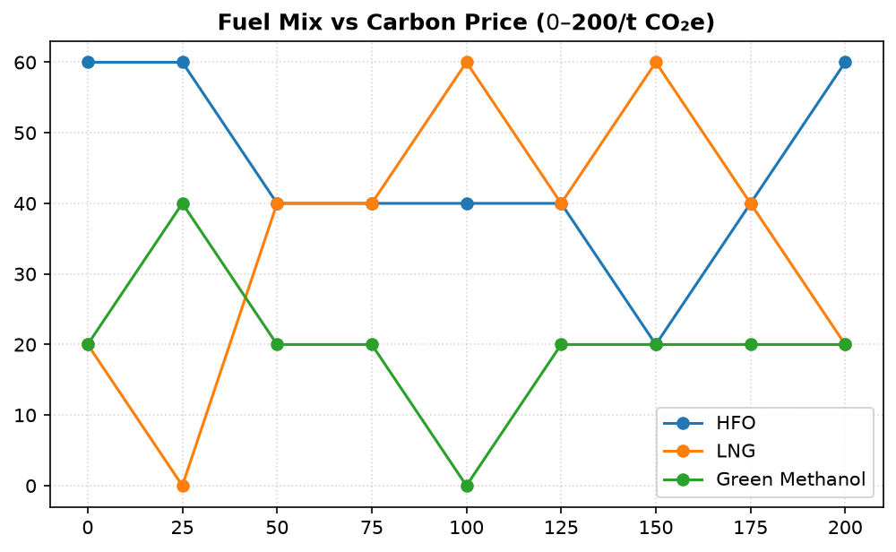

# QGreenFleet Case Study Results

*Generated by `python -m src.case_study.run` — every figure below is computed from `outputs/case_study/*/summary.json`; nothing is typed in by hand.*

Reference fleet: 20 vessels on 5 route corridors. Search budget per scenario: population 100 × 100 generations (10,000 evaluations), seed 42.

## Recommended (knee) plan vs business-as-usual

| Scenario | Carbon price | Fuel cost | Δ vs BAU | WtW CO₂e | Δ vs BAU | OPEX Δ | Ships deployed | Fuel switches | Avg speed Δ | Feasible |
| :--- | :---: | :---: | :---: | :---: | :---: | :---: | :---: | :---: | :---: | :---: |
| baseline | $0/t | $1.22M | -60.3% | 3,370 t | -80.0% | -37.5% | 5 (BAU 6) | 2 | -4.73 kn | yes |
| carbon_100 | $100/t | $0.78M | -74.6% | 3,841 t | -77.2% | -53.5% | 5 (BAU 6) | 3 | -4.09 kn | yes |
| cii_tightened | $0/t | $1.22M | -60.3% | 3,370 t | -80.0% | -37.5% | 5 (BAU 6) | 2 | -4.73 kn | yes |
| meoh_subsidized | $0/t | $1.32M | -57.1% | 3,747 t | -77.8% | -42.0% | 5 (BAU 6) | 2 | -4.37 kn | yes |
| green_corridor | $100/t | $0.78M | -74.6% | 3,841 t | -77.2% | -53.5% | 5 (BAU 6) | 3 | -4.09 kn | yes |

## Findings

1. **Baseline.** The recommended plan cuts fuel cost by 60.3% ($1.86M) and cuts well-to-wake CO₂e by 80.0% (13,482 t) against business-as-usual, deploying 5 ships at an average of -4.73 kn versus BAU speed.
2. **Fuel mix of deployed ships (baseline):** HFO 60%, MEOH_GREEN 20%, LNG_DIESEL 20%.
3. **Carbon price sweep ($0–$200/t):** there is no sustained crossover — green methanol's share never stays at or above HFO's across the rest of the range. Methanol share goes 20% → 20%, HFO 60% → 60%.
4. **Tightened CII (−11% limit):** the recommended plan is unchanged — the tighter limit does not bind for this fleet at the chosen speeds.
5. **Green corridor what-if** (hypothetical H₂/NH₃ bunkering on one route, dual-fuel container ships, $100/t carbon): deployed fuel mix LNG_DIESEL 60%, HFO 40%; CO₂e -77.2% and OPEX -53.5% vs BAU.
6. **Constraints:** every recommended plan meets route demand, schedules, fuel availability, vessel availability and CII.

## Modelling limits
- Route demand and vessel capacity share one unit: TEU for container ships, deadweight tonnes for bulk carriers and tankers. Treat capacity coverage as indicative across ship types.
- Hydrogen and ammonia need bunkering infrastructure and engines the committed fleet does not have; they are only selectable in the green-corridor what-if, whose infrastructure is hypothetical.
- Fuel consumption comes from the EU MRV model with admiralty-law speed scaling; see `outputs/mrv_model_report.md` for its measured accuracy.

