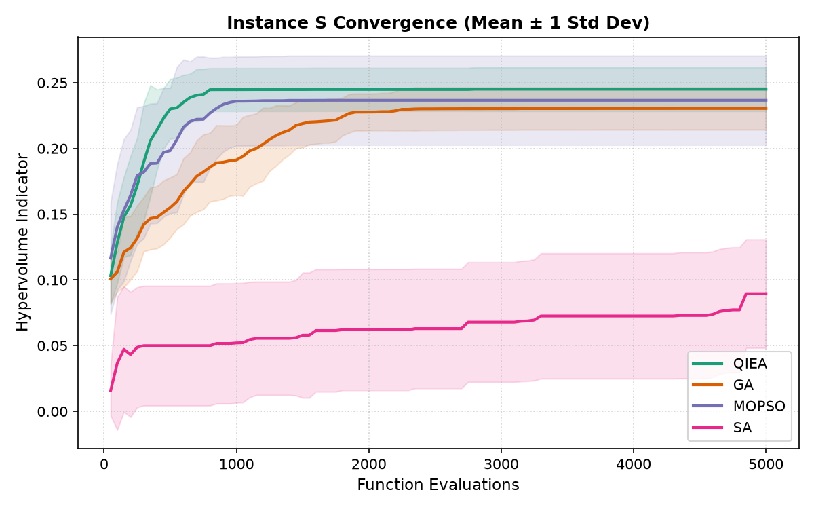
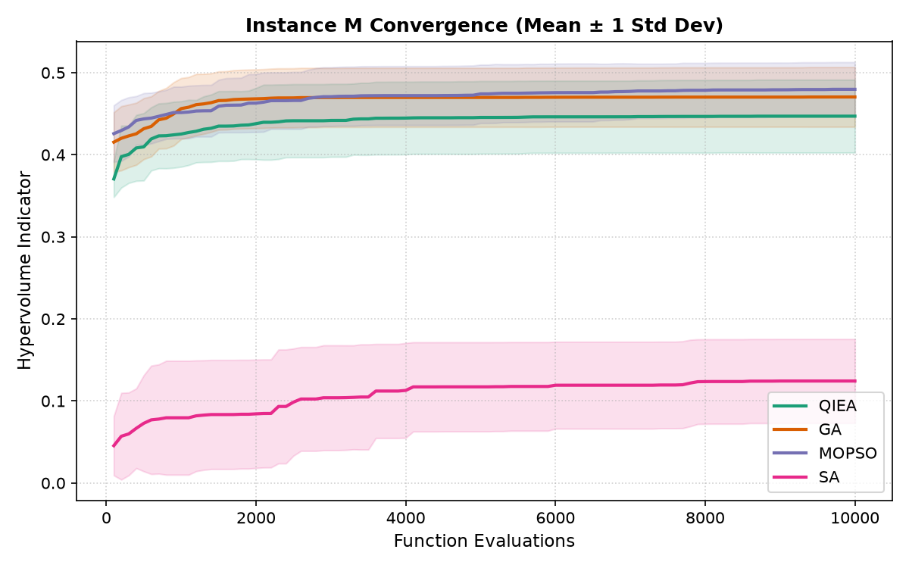
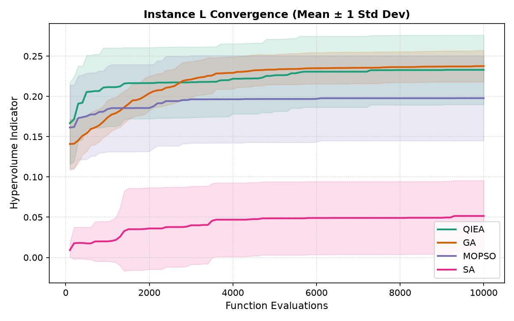
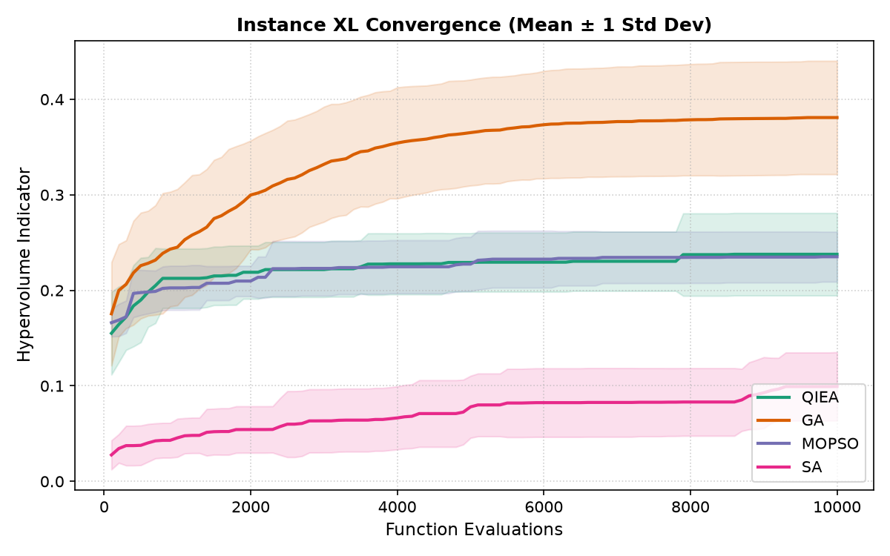
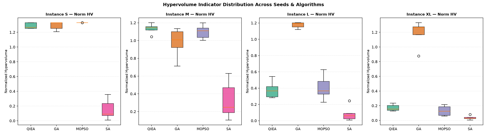
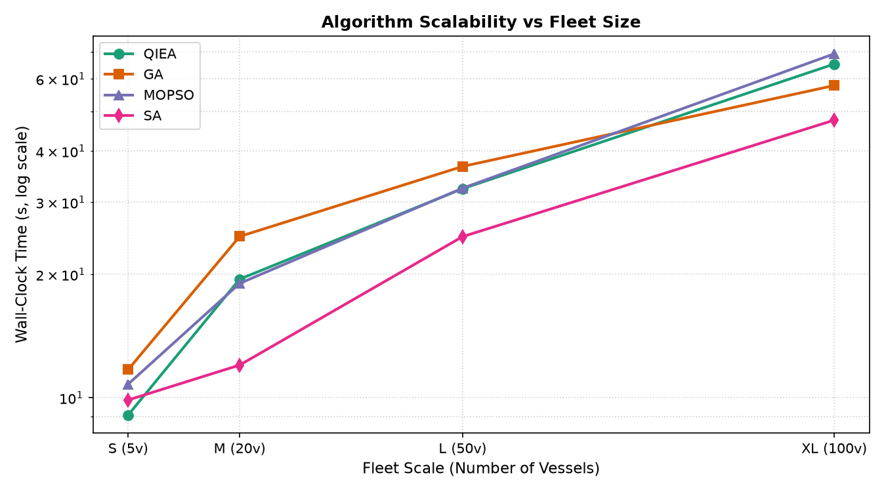

# QGreenFleet Multi-Objective Benchmarking Report (SIH #26138)

## Executive Summary
This empirical benchmarking study rigorously evaluates the proposed **Quantum-Inspired Evolutionary Algorithm (QIEA) with Quantum-behaved Particle Swarm Optimization (QPSO)** against established classical metaheuristics across fleet scales from 5 to 100 vessels:
- **Genetic Algorithm (GA)**: NSGA-II real-binary hybrid with tournament selection and arithmetic crossover.
- **Multi-Objective PSO (MOPSO)**: Continuous velocity with sigmoid binary discretization.
- **Simulated Annealing (SA)**: Single-solution scalarized search with identical function evaluation budget.

## Metric Methodology

All quality metrics are computed in a **post-pass** after all experiments complete:
1. **Fair archive extraction**: Only feasible solutions' `raw_objectives` (unpenalized) contribute to the Pareto front stored in `.npy` archives.
2. **Global normalization**: Per-objective [min, max] are computed across ALL algorithms and seeds for each instance. Every front is scaled to [0, 1]³ using these shared bounds.
3. **Normalized HV**: Computed vs fixed reference point (1.1, 1.1, 1.1). Maximum possible = 1.1³ = 1.331. Values are directly comparable across instances.
4. **Merged reference front**: The IGD reference is the non-dominated set of ALL normalized fronts pooled together. No algorithm serves as its own reference.
5. **evals\_to\_95**: Derived from per-generation normalized HV history. Returns N/A if the metric saturates at initialization (no search needed) or if history is missing.

### Fair Benchmark Protocol
1. **Identical Evaluation Budget**: Each algorithm executes N_eval = pop_size × generations evaluations.
2. **Shared Domain Operators**: All algorithms invoke identical C1 demand repair, IMO CII validation, and adaptive penalty.
3. **Decoupled Surrogate**: All models evaluate fuel consumption through the calibrated FuelPredictor surrogate.

---

## Benchmark Results by Instance

### Fleet Instance S
> *5 seeds per algorithm.*

| Algorithm | Archive Size | Norm HV [0–1.331] ↑ | IGD (Merged Ref) ↓ | Evals to 95% HV ↓ | Spread ↑ | Wall Time (s) |
| :--- | :---: | :---: | :---: | :---: | :---: | :---: |
| **QIEA** | 30.6 | 1.2865 ± 0.0404 | 0.0139 ± 0.0119 | **490** | 0.0795 ± 0.0926 | 9.08s |
| **GA** | 61.4 | 1.2904 ± 0.0568 | 0.0135 ± 0.0201 | 1,490 | 0.0300 ± 0.0244 | 11.72s |
| **MOPSO** | 95.0 | **1.3302 ± 0.0001** | **0.0006 ± 0.0001** | 660 | 0.0135 ± 0.0027 | 10.80s |
| **SA** | 2.4 | 0.1525 ± 0.1409 | 1.0311 ± 0.2684 | 3,100 | **1.2113 ± 0.6131** | 9.88s |

### Fleet Instance M
> *5 seeds per algorithm.*

| Algorithm | Archive Size | Norm HV [0–1.331] ↑ | IGD (Merged Ref) ↓ | Evals to 95% HV ↓ | Spread ↑ | Wall Time (s) |
| :--- | :---: | :---: | :---: | :---: | :---: | :---: |
| **QIEA** | 12.8 | **1.1327 ± 0.0583** | **0.1255 ± 0.0250** | 1,120 | 0.1755 ± 0.0998 | 19.48s |
| **GA** | 84.4 | 0.9757 ± 0.1686 | 0.1555 ± 0.0459 | **840** | 0.0228 ± 0.0238 | 24.76s |
| **MOPSO** | 9.8 | 1.0973 ± 0.0797 | 0.1531 ± 0.0311 | 1,120 | 0.3049 ± 0.3130 | 19.02s |
| **SA** | 3.2 | 0.3277 ± 0.2162 | 0.6051 ± 0.2716 | 4,800 | **0.8659 ± 0.6292** | 12.02s |

### Fleet Instance L
> *5 seeds per algorithm.*

| Algorithm | Archive Size | Norm HV [0–1.331] ↑ | IGD (Merged Ref) ↓ | Evals to 95% HV ↓ | Spread ↑ | Wall Time (s) |
| :--- | :---: | :---: | :---: | :---: | :---: | :---: |
| **QIEA** | 3.6 | 0.3803 ± 0.1067 | 0.6336 ± 0.1134 | 2,780 | 1.0642 ± 0.6174 | 32.38s |
| **GA** | 6.8 | **1.1741 ± 0.0374** | **0.0773 ± 0.0195** | 3,500 | 0.5503 ± 0.7881 | 36.70s |
| **MOPSO** | 4.2 | 0.4056 ± 0.1537 | 0.5936 ± 0.1713 | **1,980** | 0.5247 ± 0.2540 | 32.48s |
| **SA** | 2.0 | 0.0853 ± 0.0947 | 1.1438 ± 0.2852 | 5,480 | **1.4967 ± 0.4708** | 24.74s |

### Fleet Instance XL
> *5 seeds per algorithm.*

| Algorithm | Archive Size | Norm HV [0–1.331] ↑ | IGD (Merged Ref) ↓ | Evals to 95% HV ↓ | Spread ↑ | Wall Time (s) |
| :--- | :---: | :---: | :---: | :---: | :---: | :---: |
| **QIEA** | 3.0 | 0.1715 ± 0.0459 | 0.9719 ± 0.1099 | **2,700** | 0.6489 ± 0.3350 | 65.24s |
| **GA** | 5.0 | **1.1826 ± 0.1808** | **0.0784 ± 0.0958** | 4,600 | 0.6834 ± 0.6480 | 57.82s |
| **MOPSO** | 3.0 | 0.1306 ± 0.0694 | 1.0584 ± 0.1836 | 3,780 | 0.3735 ± 0.1889 | 69.10s |
| **SA** | 2.0 | 0.0359 ± 0.0284 | 1.3588 ± 0.1383 | 6,180 | **1.4927 ± 0.4787** | 47.60s |

---

## Statistical Visualization & Scalability

### Wall-clock time: QIEA+QPSO vs NSGA-II GA

- **Instance S**: QIEA 1.29× faster (9.08s QIEA vs 11.72s GA)
- **Instance M**: QIEA 1.27× faster (19.48s QIEA vs 24.76s GA)
- **Instance L**: QIEA 1.13× faster (32.38s QIEA vs 36.70s GA)
- **Instance XL**: QIEA 1.13× slower (65.24s QIEA vs 57.82s GA)

---

## Key Findings (computed from the table above)
1. **Runtime:** QIEA is faster than GA on 3 of 4 instances (S, M, L) and slower on XL; the GA/QIEA time ratio ranges 0.89–1.29.
2. **Solution quality (normalised hypervolume):** QIEA ranks S: #3 of 4, M: #1 of 4, L: #3 of 4, XL: #2 of 4. Best per instance — S: MOPSO, M: QIEA, L: GA, XL: GA.
3. **Method:** quality metrics use unpenalised objectives of feasible solutions, normalised with bounds shared by all algorithms, against a merged reference front.