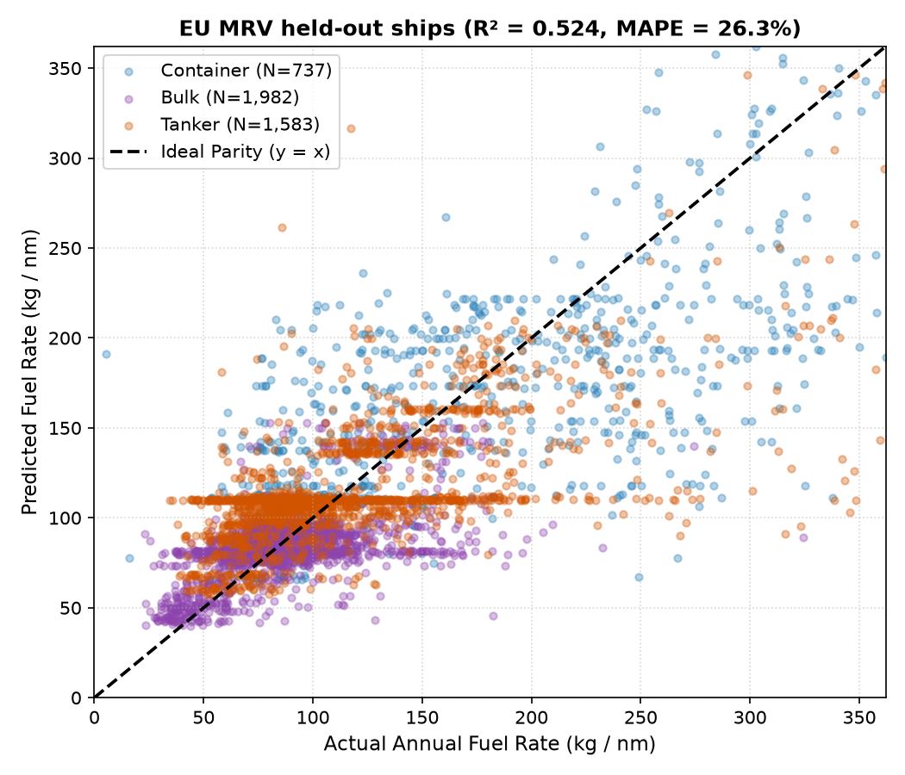

# EU MRV Fuel Prediction Model Report

Trained on **21,622 verified annual ship reports from the EU MRV THETIS database**, split 80/20 **by ship (IMO)** so no vessel appears in both training and test.

## What the model predicts
Annual-average fuel per nautical mile (kg/nm) from speed, EEDI and vessel category. `fuel_per_dwt_nm` and `laden_ratio` are excluded: the first is the target divided by deadweight, and neither is known for a fleet vessel at prediction time.

## Accuracy (held-out ships)

| Evaluation | R² | MAPE | RMSE (kg/nm) |
| :--- | :---: | :---: | :---: |
| QPSO-XGBoost, ship's own EEDI where MRV reports it | 0.524 | 26.3% | 45.2 |
| QPSO-XGBoost, EEDI unknown (category median) | 0.348 | 34.5% | 52.9 |
| XGBoost, default hyperparameters | 0.522 | 26.5% | 45.3 |
| Naive: category median | 0.234 | 36.9% | 57.4 |

5-fold CV RMSE (grouped by ship): 51.2 ± 4.3 kg/nm.

### Per category (ship's own EEDI)

| Category | Test ships | R² | MAPE | RMSE (kg/nm) |
| :--- | :---: | :---: | :---: | :---: |
| Container | 737 | 0.411 | 35.1% | 64.9 |
| Bulk | 1,982 | 0.316 | 21.0% | 25.0 |
| Tanker | 1,583 | 0.341 | 28.7% | 53.1 |

## Limits — read before quoting a number
- MRV rows are **annual averages** mixing speeds, loads and weather, so a single-voyage prediction cannot be more precise than the spread between ships of the same type and EEDI.
- Every row scores a ship **at its own operating speed**. How one ship's consumption changes when it speeds up or slows down is taken from the admiralty law (fuel/day ∝ v³), not from this model: across MRV ships, speed is confounded with size, so the data cannot identify that curve.
- Fleet vessels have no measured EEDI; the app estimates it from deadweight with the IMO EEDI reference lines (MEPC.231(65)). With no EEDI at all, use the "EEDI unknown" row. Type-level predictions (no vessel given) use each category's median speed: bulk 11.0 kn, container 13.3 kn, tanker 11.3 kn.
- Draft and weather adjustments are rule-based (see `src/prediction/predictor.py`), not learned: the voyage-level dataset has no measurable relation between its features and fuel.

